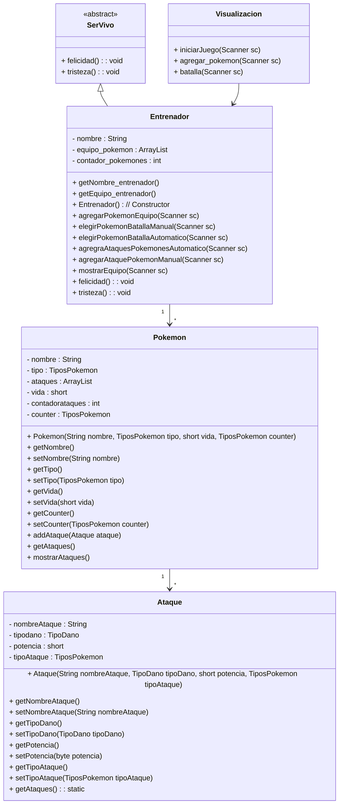

<h2 align="left">Hi üëã! My name is Samuel and I'm a Systems Engineer from Colombia</h2>

###

<div align="center">
  
</div>

###


###

<div align="left">
  
  
  
</div>

###
## 📦 Proyecto: Simulador de Batallas Pokémon
Este proyecto es una simulación de combates entre Pokémon utilizando Java. El sistema permite que entrenadores elijan y enfrenten Pokémon con distintos ataques y tipos (agua, fuego, psíquico y eléctrico).

### ✨ Características:
- Simulación por consola de batallas entre Pokémon.
- Sistema de ataques con nombre, poder y tipo.
- Clases bien estructuradas: `Entrenador`, `Pokemon`, `Ataque`, `Visualizacion`.

### 📊 Relación entre Clases

```mermaid
classDiagram
    class SerVivo {
        <<abstract>>
        + felicidad() : void
        + tristeza() : void
    }

    class Entrenador {
        - nombre : String
        - equipo_pokemon : ArrayList<Pokemon>
        - contador_pokemones : int
        + getNombre_entrenador()
        + getEquipo_entrenador()
        + Entrenador()  // Constructor
        + agregarPokemonEquipo(Scanner sc)
        + elegirPokemonBatallaManual(Scanner sc)
        + elegirPokemonBatallaAutomatico(Scanner sc)
        + agregraAtaquesPokemonesAutomatico(Scanner sc)
        + agregarAtaquePokemonManual(Scanner sc)
        + mostrarEquipo(Scanner sc)
        + felicidad() : void
        + tristeza() : void
    }

    class Pokemon {
        - nombre : String
        - tipo : TiposPokemon
        - ataques : ArrayList<Ataque>
        - vida : short
        - contadorataques : int
        - counter : TiposPokemon
        + Pokemon(String nombre, TiposPokemon tipo, short vida, TiposPokemon counter)
        + getNombre()
        + setNombre(String nombre)
        + getTipo()
        + setTipo(TiposPokemon tipo)
        + getVida()
        + setVida(short vida)
        + getCounter()
        + setCounter(TiposPokemon counter)
        + addAtaque(Ataque ataque)
        + getAtaques()
        + mostrarAtaques()
    }

    class Ataque {
        - nombreAtaque : String
        - tipodano : TipoDano
        - potencia : short
        - tipoAtaque : TiposPokemon
        + Ataque(String nombreAtaque, TipoDano tipoDano, short potencia, TiposPokemon tipoAtaque)
        + getNombreAtaque()
        + setNombreAtaque(String nombreAtaque)
        + getTipoDano()
        + setTipoDano(TipoDano tipoDano)
        + getPotencia()
        + setPotencia(byte potencia)
        + getTipoAtaque()
        + setTipoAtaque(TiposPokemon tipoAtaque)
        + getAtaques() : static
    }

    class Visualizacion {
        + iniciarJuego(Scanner sc)
        + agregar_pokemon(Scanner sc)
        + batalla(Scanner sc)
    }

    SerVivo <|-- Entrenador
    Entrenador "1" --> "*" Pokemon
    Pokemon "1" --> "*" Ataque
    Visualizacion --> Entrenador

```
###


###

### 🛠️ Tecnologías
- Java ‚òï
- Visual Studio Code 💻

### 🚀 Cómo Ejecutar
1. Clona el repositorio:
```bash
git clone https://github.com/Alvarado007/Primer-miniproyecto-java.git
```
2. Abre el proyecto en tu IDE favorito.
3. Aseg√∫rate de tener Java instalado (Java 8+).
4. Ejecuta la clase `Main` (por implementar) o una clase de prueba que cree entrenadores y pokémon para simular batallas.

### üë• Autores
- Samuel Alvarado – [GitHub](https://github.com/Alvarado007) 202459469
- Santiago Arboleda – [GitHub](https://github.com/SantiagoA0408) 202459463
- Juan Manuel Gómez – [GitHub](https://github.com/JuanManuelG26706) 202459450

### 📬 Contacto
Si quieres mejorar este proyecto o darme sugerencias, no dudes en escribirme.

<div align="left">
  
  
</div>

---

> Este es un proyecto académico con potencial para expandirse a una app con interfaz gráfica y lógica más compleja para torneos, niveles y más estrategia.
